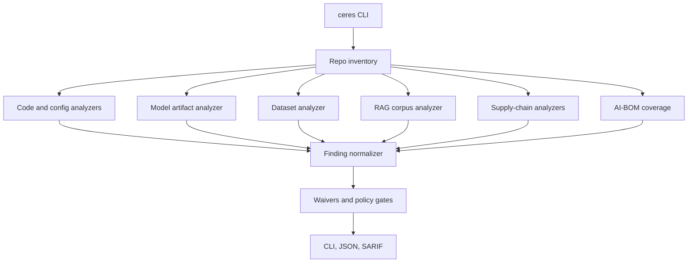

# Architecture

Ceres is a modular static scanner. Each analyzer receives the same inventory,
policy, and optional baseline, then emits normalized findings.

## Inventory

The inventory layer classifies files into code, configs, prompts, model
artifacts, datasets, RAG docs, dependency manifests, CI files, and AI-BOM inputs.

## Analyzers

Analyzers are intentionally narrow:

- Python AST analysis for loader and dangerous-code patterns
- YAML/JSON config analysis for model source and tool policy
- static model artifact parsing
- dataset manifest/fingerprint checks
- RAG document text checks
- dependency and CI/Docker checks
- optional external adapters

## Baseline

The baseline stores known-good model and dataset state. This is how Ceres catches
model tensor drift, tokenizer changes, dataset distribution shifts, and RAG/data
inventory changes without needing runtime execution.

## Reports

Findings are emitted through:

- human CLI table
- JSON
- SARIF for GitHub code scanning

Analyzer crashes are converted into `ceres.engine.analyzer_failed`, so incomplete
coverage does not look like a clean scan.
